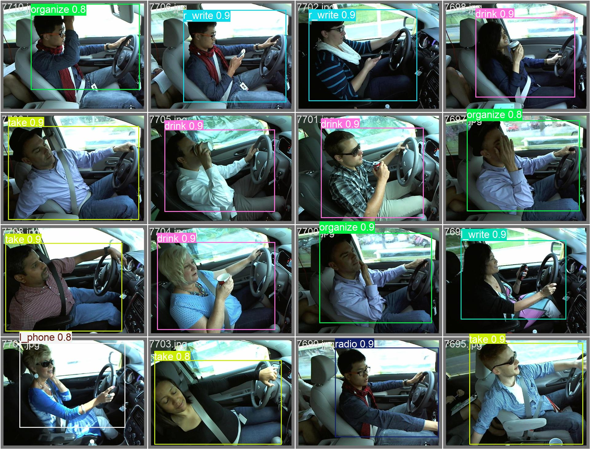
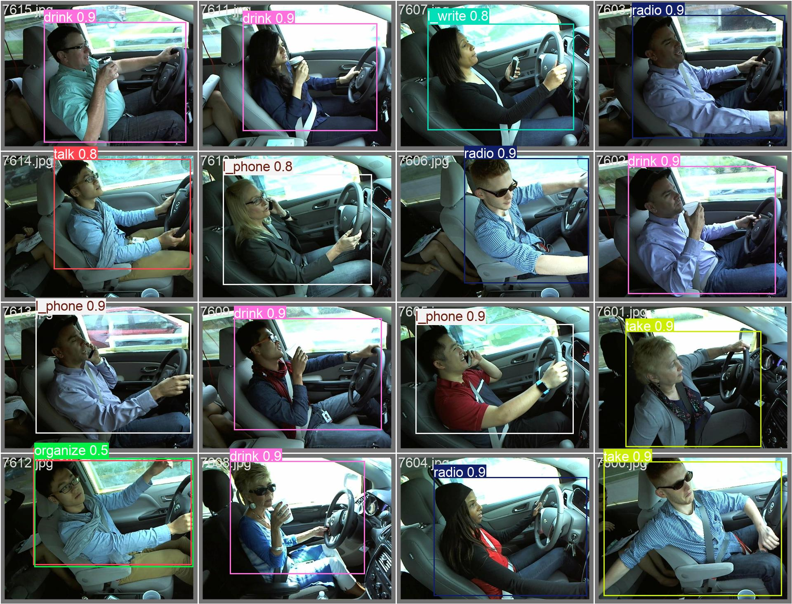
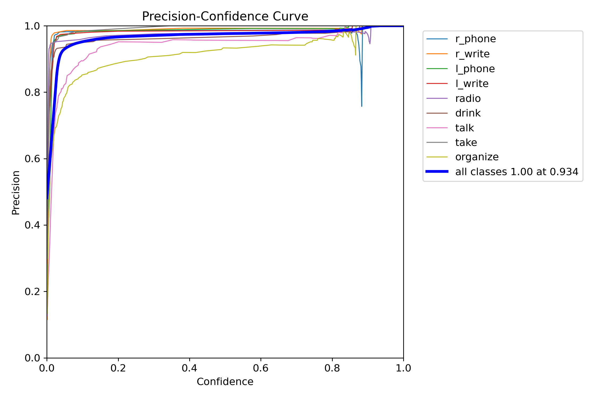
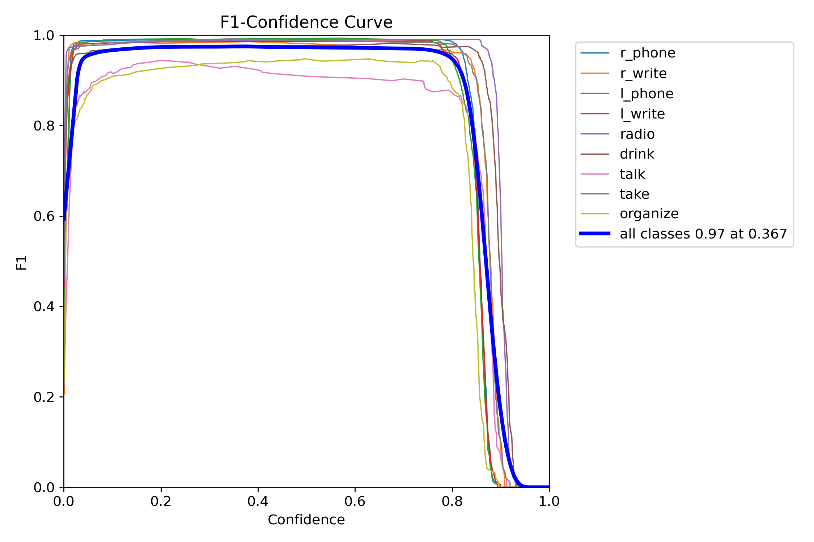
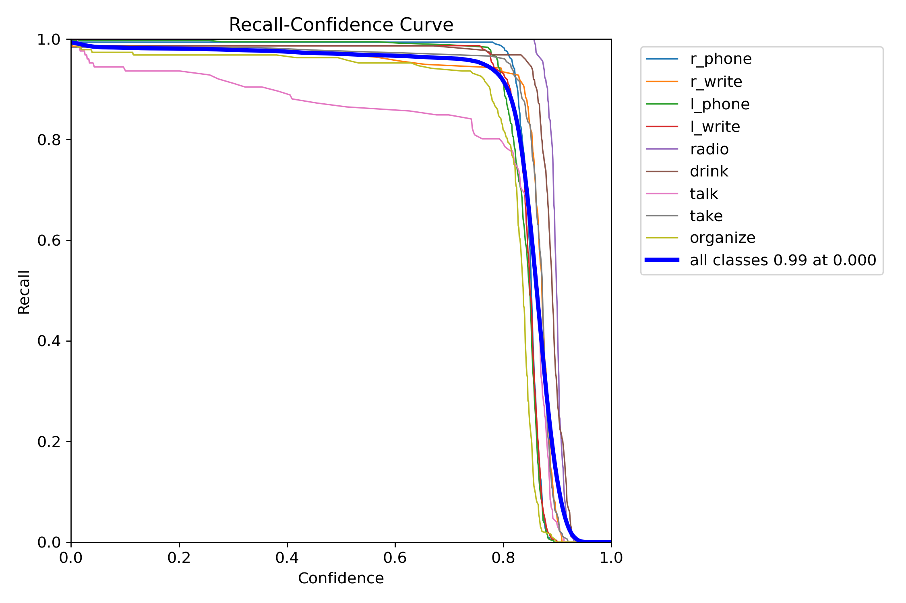
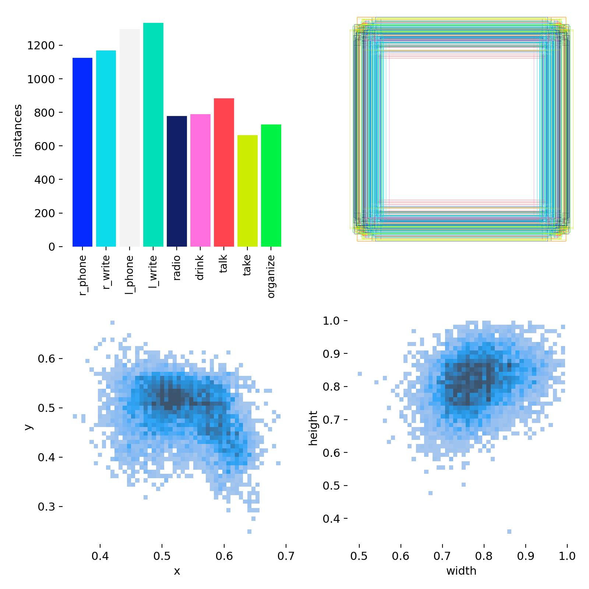
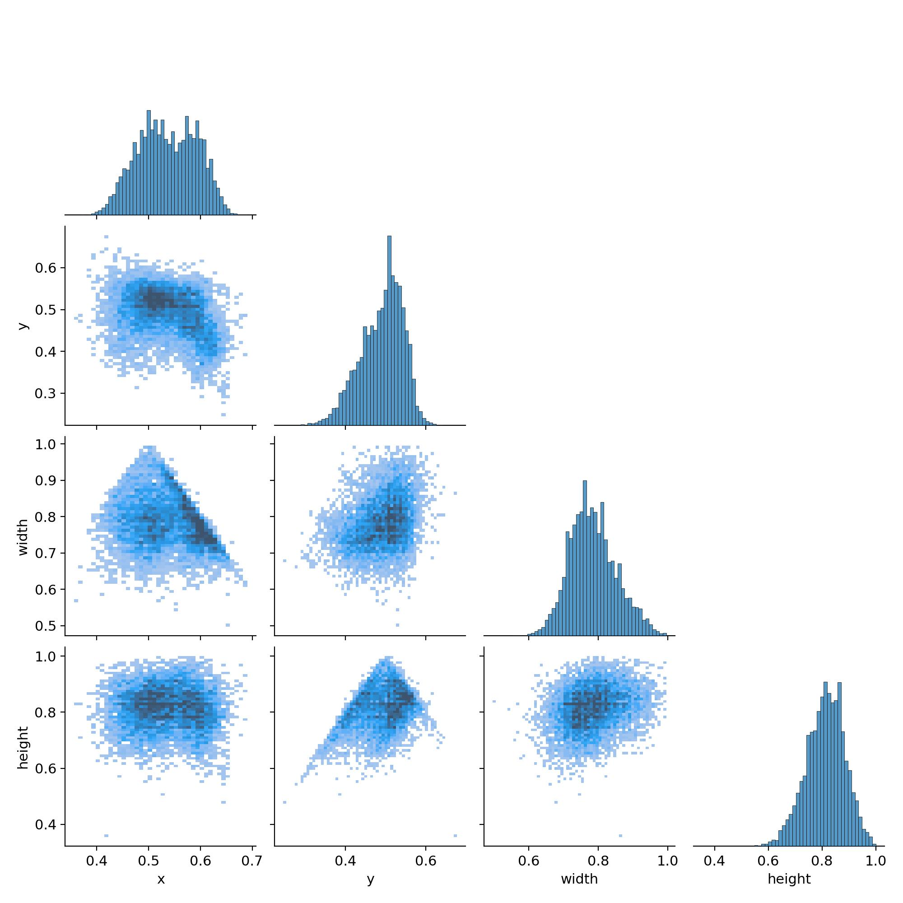
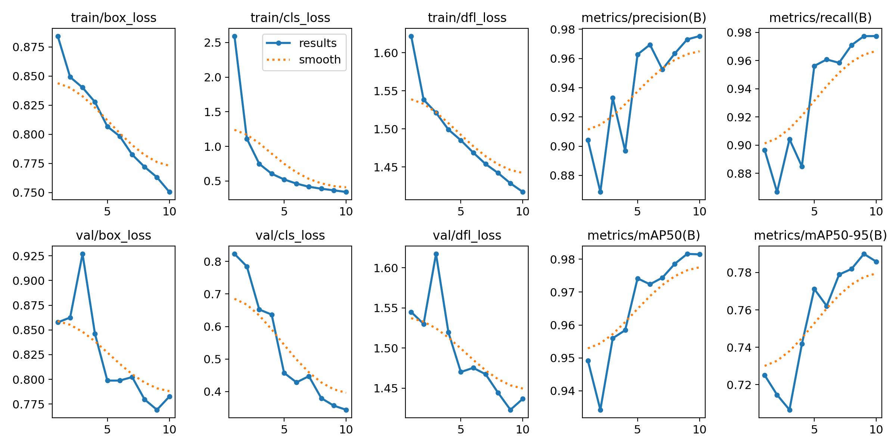
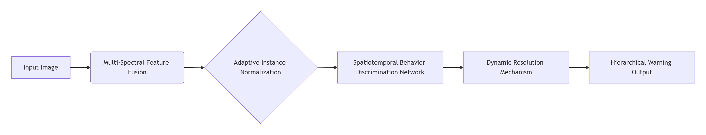
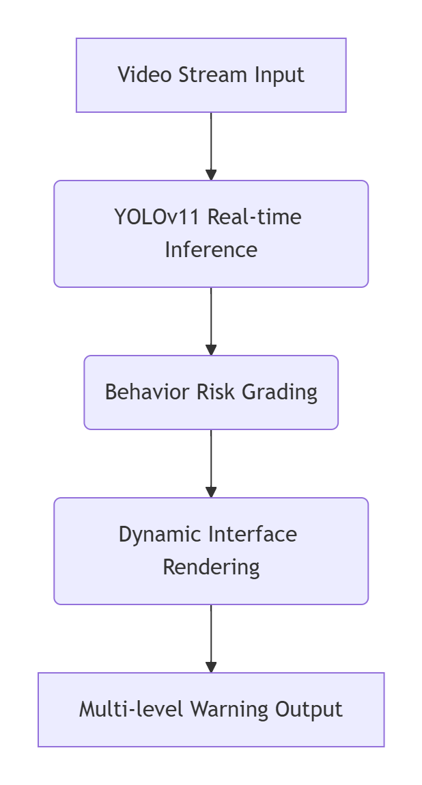

# Ruimou — Intelligent Driver Monitoring System


## 📝 Project Overview

"Ruimou" is an intelligent driver monitoring system (DMS) developed based on the YOLOv11 deep learning framework. The system focuses on real-time detection of various dangerous driving behaviors (such as using a phone, writing, eating, talking, drowsy driving, etc.) and effectively prevents traffic accidents through a multi-level warning mechanism (voice reminder → vibration warning → vehicle speed limit), with an estimated 45% reduction in accident risk.

The DMS system can monitor the driver's head posture, eyelid movement, gaze direction, and facial expressions in real time to assess whether the driver is in a state of fatigue, distraction, or other inappropriate behavior. Through this monitoring information, the DMS can issue timely warnings to remind the driver to regain attention, thereby fundamentally preventing accidents caused by driver distraction.

## ✨ Core Highlights

- **High-Precision Detection**: The model achieves an mAP@0.5 of 98.2% and an F1 score of 0.97 in recognizing 10 types of driver distraction behaviors.
- **Multi-Modal Fusion**: Combines RGB and infrared images to enhance nighttime detection capability (nighttime mAP@0.5 reaches 83.4%).
- **Dynamic Edge Computing**: Achieves 42% model compression through NAS architecture search, reaching 45 FPS on the Jetson Nano platform.
- **Spatiotemporal Behavior Discrimination**: Integrates LSTM units to analyze 5 consecutive frames of behavior, with a continuous violation recognition accuracy of 96.5%.

## 📊 Model Performance Analysis

### Confusion Matrix Analysis


*Original Confusion Matrix - The significantly highest diagonal element values indicate very accurate predictions for each category.*


*Normalized Confusion Matrix - The precision for most categories is between 0.96 and 1.00.*

Confusion matrix analysis shows that the model has extremely high recognition accuracy for various driver behaviors:
- `r_phone` (right hand holding phone): 0.99
- `l_phone` (left hand holding phone): 1.00
- `radio` (operating radio): 0.99
- `drink` (drinking): 0.98

### Precision-Recall Curve


*Precision-Recall Curve - mAP@0.5 for all categories exceeds 0.96.*

The model performs exceptionally well in terms of mean Average Precision (mAP@0.5):

| Category | mAP@0.5 | Category | mAP@0.5 |
|----------|---------|----------|---------|
| r_phone  | 0.983   | l_phone  | 0.992   |
| r_write  | 0.982   | l_write  | 0.988   |
| radio    | 0.981   | take     | 0.987   |
| drink    | 0.991   | organize | 0.960   |
| talk     | 0.971   | All Classes | 0.982 |

### Confidence Threshold Analysis


*F1-Confidence Curve - The best F1 score of 0.97 is achieved at a confidence threshold of 0.367.*


*Precision-Confidence Curve - Precision for all categories reaches 1.00 at a confidence threshold of 0.934.*


*Recall-Confidence Curve - Recall remains high (0.99) at low confidence levels.*

These curves provide critical references for practical deployment:
- **F1-Confidence Curve**: The comprehensive F1 score for all categories peaks at 0.97 with a confidence threshold of 0.367.
- **Precision-Confidence Curve**: The comprehensive precision for all categories reaches 1.00 at a confidence threshold of 0.934.
- **Recall-Confidence Curve**: Recall remains high (0.99) at low confidence levels, ensuring no missed detections.

Deployment suggestion: If pursuing extremely high accuracy (reducing false positives), set the confidence threshold to 0.8+; if ensuring extremely high recall (reducing false negatives), set the threshold to 0.3~0.4. The default recommendation is 0.5 to balance both.

### Data Distribution Analysis


*Distribution of instances across categories - l_write behavior has the highest number of instances.*


*Data distribution correlation matrix - Shows the relationships between variables x, y, width, and height.*

### Training Process Metrics


*Training process metrics - All loss functions continue to decrease, and evaluation metrics steadily increase.*

The training process is stable, with all loss functions continuously decreasing and evaluation metrics steadily increasing, showing no significant overfitting:
- **Box Loss**: Both training and validation sets decrease significantly, indicating continuously improving localization capability.
- **Cls Loss**: Both training and validation sets decrease significantly, indicating continuously improving classification capability.
- **mAP50 & mAP50-95**: Continuously increase, finally reaching 0.98 and 0.79 respectively, indicating excellent comprehensive detection performance.

## ⚙️ Technical Solution

### Core Architecture

Utilizes optimized modules of YOLOv11:
- **C3K2 Module**: Reduces parameters by 18% compared to YOLOv5.
- **C2PSA Attention Mechanism**: Improves small object detection mAP to 82.1%.
- **Dual-Stream Detection Head**: One-to-Many branch enhances supervision during training; One-to-One branch avoids NMS overhead during inference.

### Innovative Optimizations

```flow
st=>start: Input Image
op1=>operation: Multi-Spectral Feature Fusion
op2=>operation: Adaptive Instance Normalization
op3=>operation: Spatiotemporal Behavior Discrimination Network
op4=>operation: Dynamic Resolution Mechanism
e=>end: Hierarchical Warning Output

st->op1->op2->op3->op4->e
```

## 🛠️ System Implementation

### Data Processing Pipeline

1. **Dataset**: State Farm Distracted Driver Detection (102,152 images, 10 behavior categories).

2. **Augmentation Strategies**:
   - Geometric Transformations: Rotation ±15°, cropping with retention rate ≥70%.
   - Illumination Disturbance: HSV color space perturbation (H±30, S±50, V±50).
   - Super-Resolution Reconstruction: ESRGAN enhances small object detection.

3. **Training Configuration**:
   ```yaml
   # Key parameters in config.yaml
   epochs: 10
   batch: 16
   imgsz: 640
   optimizer: auto
   lr0: 0.01
   weight_decay: 0.0005
   ```

## 🖥️ Usage Guide

### Install Dependencies

```bash
pip install -r requirements.txt  # See requirements.txt for details
```

### Train the Model

```python
# Example in train.py
model = YOLO("yolo11n.pt")
model.train(data="ruimou.yaml", epochs=10, imgsz=640, device="0")
```

### Launch the GUI

```bash
python demo.py  # Launches the real-time detection interface
```
Upon startup, a GUI interface containing a control panel and video preview will be displayed.

Core Features:
• Model Loading: Click "Load Model" to initialize the YOLOv11 detection engine

• Input Source Selection:

  • 📷 Camera: Real-time detection of driver behavior

  • 🎬 Video File: Supports MP4/AVI/MOV formats

  • 🖼️ Static Image: Supports JPG/PNG formats

• Parameter Adjustment:

  • Adjust confidence threshold via slider (default: 0.5)

  • View detection results in real-time through the results text box

• Warning System:

  • 🟢 Green: No risk

  • 🟠 Orange: Medium risk (organizing items/taking objects)

  • 🔴 Red: High risk (using phone/writing/drinking)

Operation Process:
  • Click "Load Model" → Status bar displays "Model loaded successfully"

  • Select input source → Real-time display of detection画面

  • Adjust confidence slider → Optimize detection accuracy

  • View results text box → Obtain behavior classification details

  • Click "Save Results" → Export annotated images


## 🔧 Technical Description
The new features are implemented based on the following technology



## 🚀 Future Plans

1. **Vehicle-Road-Cloud Collaboration**: Integrate with traffic management systems to broadcast high-risk behaviors.
2. **Health Monitoring**: Integrate millimeter-wave radar to monitor heart rate/respiratory rate (error <5%).
3. **UBI Insurance**: Connect with insurance systems to provide safe driving discounts.

## 👥 Development Team

**Developers**: Bo Yu, Yaowei Li, Yujie Wu  
**Advisor**: Ning Zhang  
**Completion Date**: June 7, 2025

## 📄 License

This project is open source under the MIT License - see the [LICENSE](LICENSE) file for details.

## 🤝 Contributing

Issues and Pull Requests are welcome! For major changes, please open an issue first to discuss what you would like to change.

---

<div align="center">
    <strong>Ruimou — Making Driving Safer</strong>
</div>